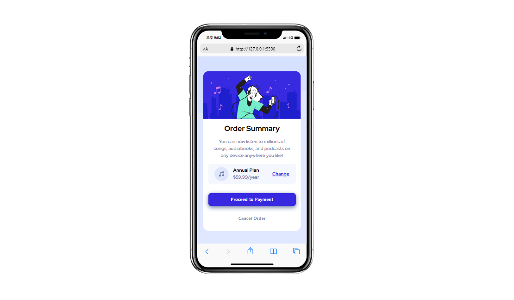

# Frontend Mentor - Order summary card solution


## Table of contents

- [Overview](#overview)
  - [The challenge](#the-challenge)
  - [Screenshot](#screenshot)
  - [Links](#links)
- [My process](#my-process)
  - [Built with](#built-with)
  - [What I learned](#what-i-learned)
- [Author](#author)

## Overview

### The challenge

Users should be able to:

✅ See hover states for interactive elements

### Screenshot



### Links

- Solution URL: [solution URL here](https://www.frontendmentor.io/solutions/order-summary-component-6sySCVA8pU)
- Live Site URL: [live site URL here](https://hyeyoung-lucia.github.io/order-summary-component-main/)

## My process

### Built with

- Semantic HTML5 markup
- CSS custom properties
- Flexbox
- Mobile-first workflow

### What I learned

- How to implement hover states for interactive elements

  ✨main features below:

```css
a {
  font-size: var(--font-medium);
  text-decoration: underline;
  color: var(--color-bright-blue);
  font-weight: var(--weight-medium);
}

a:hover {
  opacity: 0.7;
  text-decoration: none;
  cursor: pointer;
}

#payment {
  border: none;
  border-radius: 10px;
  width: 300px;
  height: 45px;
  color: white;
  background-color: var(--color-bright-blue);
  font-size: 15px;
  font-weight: var(--weight-bold);
  margin-bottom: 20px;
  box-shadow: var(--color-desaturated-blue) 0px 5px 15px;
}

#payment:hover {
  opacity: 0.7;
  cursor: pointer;
}

#cancel-order {
  border: none;
  border-radius: 10px;
  width: 300px;
  height: 45px;
  color: var(--color-desaturated-blue);
  background-color: white;
  font-size: 15px;
  font-weight: var(--weight-bold);
  margin-bottom: 20px;
}

#cancel-order:hover {
  color: black;
  cursor: pointer;
}
```

## Author

Hyeyoung Lee

- Frontend Mentor - [@Hyeyoung-Lucia](https://www.frontendmentor.io/profile/Hyeyoung-Lucia)
